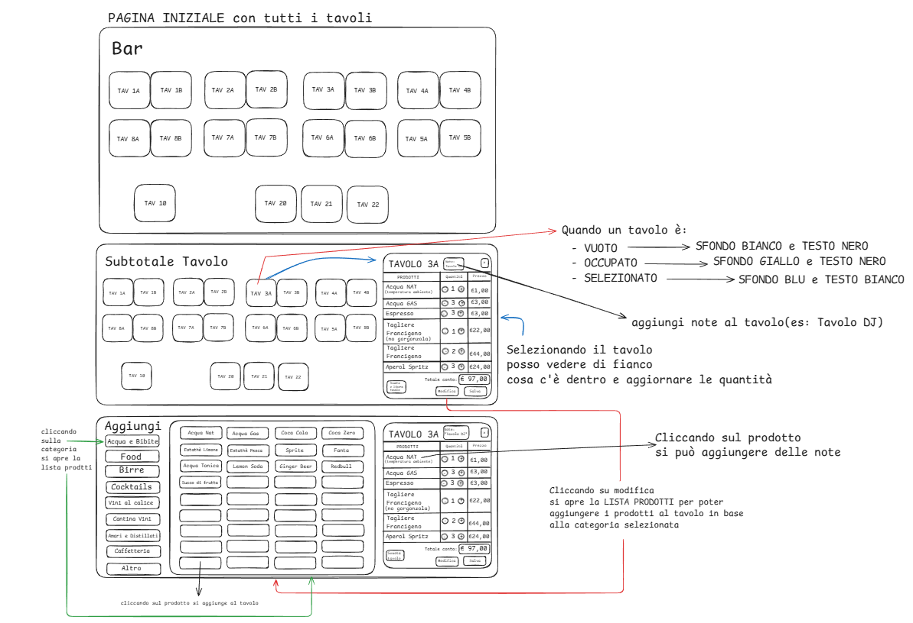

# 🍹 Gestionale Bar

## Descrizione del Progetto:

Questo progetto è un **gestionale bar** pensato per la gestione rapida e intuitiva dei **tavoli**, degli **ordini** e dei **prodotti**, ottimizzato per l’utilizzo da banco.

L’interfaccia è progettata per essere **touch-friendly**, chiara e immediata, riducendo al minimo il numero di click necessari per prendere una comanda.

---

## 🎯 Obiettivi:

- Visualizzare tutti i tavoli del locale in un’unica schermata
- Capire a colpo d’occhio lo stato di ogni tavolo
- Gestire ordini e quantità in modo veloce
- Aggiungere note a tavoli e prodotti
- Ridurre errori durante la presa delle comande

---

## 🖼️ Wireframe (Excalidraw):

Di seguito i wireframe realizzati con **Excalidraw**, che descrivono il flusso principale dell’applicazione:

> 📌 _Nota:_ il wireframe mostra la pagina iniziale con i tavoli, il pannello di dettaglio del tavolo selezionato e la schermata di selezione prodotti per categoria.

---

## 🧭 Flusso Principale

### 1️⃣ Pagina Iniziale – Tavoli:

All’apertura dell’applicazione viene mostrata la **pagina iniziale con tutti i tavoli** del bar.

Ogni tavolo è rappresentato da un riquadro con:

- Nome/numero del tavolo (es. `TAV 3A`)
- Colore che indica lo stato

#### Stato Tavoli:

| Stato       | Colore Sfondo | Colore Testo |
| ----------- | ------------- | ------------ |
| Vuoto       | Bianco        | Nero         |
| Occupato    | Giallo        | Nero         |
| Selezionato | Blu           | Bianco       |

---

### 2️⃣ Selezione Tavolo:

Cliccando su un tavolo:

- Il tavolo diventa **selezionato**
- Si apre il **pannello laterale** con la preview del tavolo

Nel pannello sono visibili:

- Lista dei prodotti
- Quantità modificabili
- Prezzo singolo
- Totale del tavolo

---

### 3️⃣ Gestione Ordine Tavolo:

Per il tavolo selezionato è possibile:

- ➕ Aumentare o diminuire le quantità
- ❌ Rimuovere un prodotto
- 📝 Aggiungere una **nota al tavolo** (es. `Tavolo DJ`)
- 📝 Aggiungere **note ai singoli prodotti** (es. `senza ghiaccio`)

Il **totale conto** viene aggiornato automaticamente ad ogni modifica.

---

### 4️⃣ Aggiunta Prodotti:

Cliccando su **Modifica**:

- Si apre la schermata con la **lista prodotti**
- I prodotti sono suddivisi per **categorie**

#### Esempio Categorie

- Acqua e Bibite
- Food
- Birre
- Cocktails
- Vini al calice
- Cantina vini
- Amari e distillati
- Caffetteria
- Altro

Cliccando su un prodotto:

- Il prodotto viene **aggiunto direttamente al tavolo selezionato**
- Sulla categoria **Altro** c'è la possibilità di cliccare un tasto **Prodotto personalizzato** per il quale si può decidere (inserendo tramite form) il **nome** , le **note** e il **prezzo** del prodotto che poi verrà aggiunto al tavolo.

---

## 🧩 Regole:

- Un tavolo passa automaticamente allo stato **Occupato** quando contiene almeno un prodotto
- Un tavolo torna **Vuoto** quando non ha più prodotti
- Le note sono **facoltative** ma sempre modificabili
- Le modifiche sono immediate (no conferme aggiuntive)

---

## 👤 User Story di Riferimento:

Come barista / operatore di cassa voglio gestire tavoli e ordini da un’unica schermata così da prendere comande velocemente e ridurre gli errori che potrebbero verificarsi utilizzando comande cartacee:

- **perdita della comanda**
- **errori di trascrizioni e leggibilità**
- **errori di prezzo e/o nel calcolo del totale da pagare**

---

Cliccando su **Dividi Conto** il programma prende il totale e lo suddivide in parti uguali per il numero dei paganti inserito manualmente dall'operatorte.

---

Il Gestionale utilizza un **Local Storage**.

---

## 🚀 Possibili Estensioni Future:

- Possibilità di spuntare il prodotto come "pagato" così che il prodotto resti nel tavolo **sbarrato ma leggibile** e che l'importo relativo
  venga aggiornato in tempo reale **il tutto per semplificare la gestione dei pagamenti se venissero effettuati in momenti diversi**
- Storico ordini per tavolo
- Integrazione con magazzino
- Storico del venduto
- Storico incassi del giorno per controllo incrociato con chiusura cassa

---

## 📐 Design:

- Interfaccia semplice e leggibile
- Pochi colori ma significativi
- Ottimizzata per tablet
- Azioni sempre visibili e raggiungibili

---
